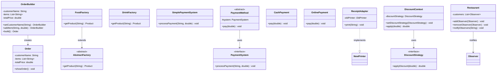

# UML Diagrams
## 1) All Patterns Included

```mermaid
classDiagram
    %% Creational Patterns
    class OrderBuilder {
        -customerName: String
        -items: List~String~
        -totalPrice: double
        +setCustomerName(String) OrderBuilder
        +addItem(String, double) OrderBuilder
        +build() Order
    }
    
    class Order {
        -customerName: String
        -items: List~String~
        -totalPrice: double
        +showOrder() void
    }
    
    class AbstractFactory {
        <<abstract>>
        +getProduct(String) Product
    }
    
    class FoodFactory {
        +getProduct(String) Product
    }
    
    class DrinkFactory {
        +getProduct(String) Product
    }
    
    %% Structural Patterns
    class PaymentSystem {
        <<interface>>
        +processPayment(String, double) void
    }
    
    class SimplePaymentSystem {
        +processPayment(String, double) void
    }
    
    class PaymentMethod {
        <<abstract>>
        #system: PaymentSystem
        +pay(double) void
    }
    
    class CashPayment {
        +pay(double) void
    }
    
    class OnlinePayment {
        +pay(double) void
    }
    
    class ReceiptAdapter {
        -oldPrinter: OldPrinter
        +print(String) void
    }
    
    %% Behavioral Patterns
    class DiscountStrategy {
        <<interface>>
        +applyDiscount(double) double
    }
    
    class DiscountContext {
        -discountStrategy: DiscountStrategy
        +setDiscountStrategy(DiscountStrategy) void
        +apply(double) double
    }
    
    class Restaurant {
        -customers: List~Observer~
        +addObserver(Observer) void
        +removeObserver(Observer) void
        +notifyObservers(String) void
    }
    
    %% Relationships
    OrderBuilder --> Order : creates
    FoodFactory --> AbstractFactory : extends
    PaymentMethod --> PaymentSystem : uses
    ReceiptAdapter ..|> NewPrinter : implements
    DiscountContext --> DiscountStrategy : uses
    Restaurant --> Observer : notifies
```
